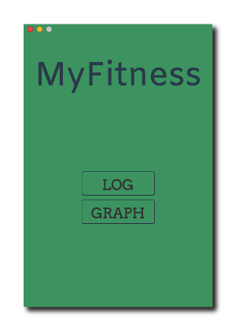

MyFitness <span style="color: #03C9A9;">**[UNDER DEVELOPMENT]**</span>
========= 

A personal fitness tracker; written using Electron and <http://electron.atom.io/>.

<p align="center">
    
</p>

### Features
- TODO

Installation
------------
Install Node.js: <https://nodejs.org/en/>

```sh
# Install dependencies
$ npm install

# Install MyFitness (it will be installed in the /Applications directory where all your apps live)
$ npm run package-osx
```

NOTE: MyFitness.app is only tested on Mac OSX.

Future Improvements / New Features / Issues
-------------------------------------------
#### New Features (Future Improvements)

#### Issues
- No known issues yet

Author
------
Deep Aggarwal  
deep.uiuc@gmail.com  
Date Started: 10/19/2016  
